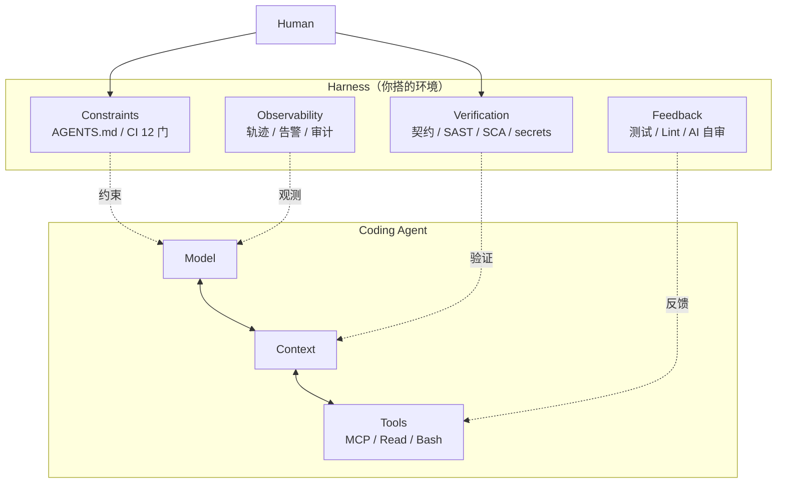

# Harness Engineering

> **把 AI Coding Agent 装上"缰绳"：约束 + 反馈 + 验证。**
> 2026 年 AI 工程化核心范式——同一模型 + 优化 Harness，编码基准排名能从 30+ 冲到 Top 5（LangChain 实验）。

## What it is

**Coding Agent = Model + Context + Tools + Constraints + Feedback + Human Control**

围绕 Agent 搭建的"工作环境" = Harness：
- **约束（Constraints）**：Rules（AGENTS.md）、Lint、CI 硬关、Spec
- **反馈（Feedback）**：测试结果、Lint、AI 自审、AgentOps 指标
- **验证（Verification）**：CI 12 门、Spectral、SAST/SCA/secrets、契约 diff

## Key Properties / Tradeoffs

**9 维设计**（详见 `materials/09`）：

| 维度 | 一句话 |
|---|---|
| 1. Model | 选型 + 多模型路由 |
| 2. Context | AGENTS.md / Spec / 代码库索引 |
| 3. Tools | 必备 5 件套 + MCP 工具集 |
| 4. Constraints | 4 层：合规/安全/契约/风格 |
| 5. Feedback | 4 来源：测试/lint/AI/人工 |
| 6. Human Control | 意图/审査/不可逆/事故 |
| 7. Memory | 项目级 + 会话级 + 跨会话 |
| 8. Eval | 金标集 + 回放 + 趋势 |
| 9. Observability | 轨迹/回放/告警/审计 |

✅ 工具是杠杆，Harness 才是支点。
⚠️ 搭 Harness 是一次性 + 渐进式，不要一次写完。

## Relationship to Other Concepts

- [[Spec Driven Development]] — Spec 是 Harness 的"约束"层核心
- [[TDD]] — TDD 是 Harness 的"反馈"层核心
- [[LLM Wiki Pattern]] — Wiki 是 Harness 的"Memory"层扩展
- [[claude-code]] — 工具的视角

## Mermaid Diagram

## Open Questions

- [ ] 多 Agent 协同时 Harness 怎么拆？
- [ ] Harness 升级怎么不打断团队？
- [ ] Eval 集多大才够？

## Sources

- `materials/09_Harness工程化指南.md` — 本仓库 Harness 详细 9 维
- `materials/05_Rules模板_AGENTS.md` — 约束层
- `materials/07_CI门与发版策略.md` — 验证层
- `materials/08_AgentOps_可观测与回滚.md` — 观测层
