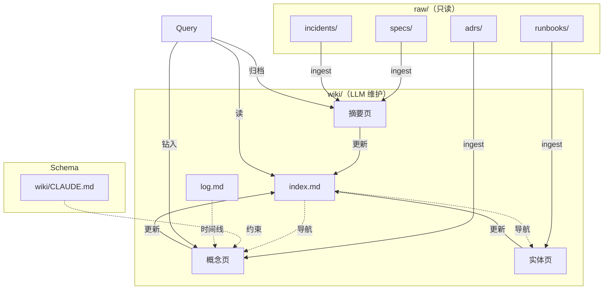

# LLM Wiki Pattern

> **让知识以复利方式积累，不消失在聊天记录里。**
> Andrej Karpathy 2026 年初提出（[原始 Gist](https://gist.github.com/karpathy)），nashsu 实践化（[github.com/nashsu/llm_wiki](https://github.com/nashsu/llm_wiki)）。

## What it is

> 传统 RAG 死于"每次问都重拼"；LLM Wiki 升级为"知识编译"——LLM **持续把零散资料编译为带双向链接的结构化知识**。

**3 层架构**：
```
raw/      ← 原始资料（只读，事实来源）
wiki/     ← LLM 全权维护的知识层
CLAUDE.md ← Schema（你 + LLM 共同迭代）
```

**5 个核心操作**：ingest / query / lint / render-graph / audit

**关键洞察**：
- 知识是**持久化、复利**的产物
- 双向链接、矛盾标注、综合分析**都已存在**，查询时不重拼
- 人负责"采集 + 提问 + 思考"，LLM 负责"整理 + 链接 + 维护"

## Key Properties / Tradeoffs

✅ **优点**：
- 知识积累**复利**（每次 ingest 影响 10-15 页）
- 跨 session **不丢上下文**
- Obsidian 图谱视图**直观**看知识结构
- **git 免费**获得版本历史 + 协作

⚠️ **反模式**（要避开）：
- ❌ 子目录 + 多个分类（`concepts/entities/summaries/`）—— 简单 frontmatter `type` 字段足够
- ❌ 复杂 skill 系统（4 个 Python 脚本足够）
- ❌ 前端 / UI（Obsidian 就是 UI）
- ❌ 10+ 个 Schema 文件（一份 CLAUDE.md 足够）
- ❌ 几十个分类 + 几 k 文件（臃肿 → 难维护）

✅ **极简范式**（本仓库采用）：
- 单 `CLAUDE.md` + 平铺 wiki 目录
- `log.md` 用可解析前缀 `## [YYYY-MM-DD] op | name`
- `index.md` 是唯一目录
- 4 个 Python 脚本：ingest / lint / render_graph / mcp_server

## Relationship to Other Concepts

- [[Harness Engineering]] — Wiki 是 Harness 的"Memory"层（项目级持久记忆）
- [[Spec Driven Development]] — SDD 的产物（spec/ADR）是 wiki 的 raw 资料源
- [[TDD]] — Wiki 中"测试证据"类内容来自 TDD
- 根 [[../CLAUDE.md]] — Schema 范式参考

## Mermaid Diagram



## Open Questions

- [ ] Wiki 达到多大规模必须升级到 qmd 全文搜索？
- [ ] 跨项目 Wiki 联邦？
- [ ] Wiki 的 PR review 流程怎么设计？

## Sources

- [nashsu/llm_wiki](https://github.com/nashsu/llm_wiki) — 核心理念 + 实践参考
- [Andrej Karpathy LLM Wiki Gist](https://gist.github.com/karpathy) — 原版
- 本仓库 [[../../wiki/CLAUDE.md|wiki/CLAUDE.md]] — 实例化版
