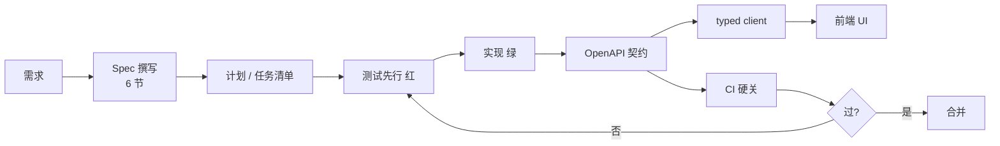

# Spec Driven Development

> **把"写完没人看的文档"升级为"能卡住 AI 输出的执行性合约"。**
> 6 步流水线：宪法约束 → 功能 spec → 实现计划 → 任务清单 → 测试先行 → 验收检查。

## What it is

SDD 是 2025-2026 在 AI Coding 领域涌现的方法论：
- **Spec 是首要输入**，不是事后文档
- AI/代码生成器**直接把 spec 转换成实现、测试、监控管道**
- 规格成为"事实来源"（source of truth）：写 spec → AI 实现 → 自动验证（测试/合规）

vs 传统文档驱动：
| 传统 | SDD |
|---|---|
| 文档 = 给 PM 看 | spec = 给 AI 编译 |
| 写完无人问津 | 改 spec 必须同步改测试+契约 |
| AI 自由发挥 | spec 划界 + 范围划死 |

## Key Properties / Tradeoffs

✅ **优点**：
- **AI 翻车率下降**：spec 是机器可读的指令，不是"尽量做单元测试"
- **审查成本前移**：人审 spec（十几行），不审实现（上百行）
- **下游自动传导**：spec → OpenAPI → typed client → 前端

⚠️ **代价**：
- 写 spec 有学习成本（要写到"能写成测试"的程度）
- spec 维护需要纪律（改实现前先改 spec）
- 治理需要工具（spectral / oasdiff / mutation testing）

## Relationship to Other Concepts

- [[TDD]] — spec 是"做什么"，TDD 是"怎么验"，两者配对使用
- [[Harness Engineering]] — spec 是 Harness 中"约束"层的内容
- [[LLM Wiki Pattern]] — wiki 中"概念页"的源头往往是 spec/ADR
- [[todo-api]] — SDD 的最小可跑范例

## Mermaid Diagram

## Open Questions

- [ ] spec 长到多长需要拆？
- [ ] spec 改了，怎么保证所有下游（client/mock/docs）原子更新？
- [ ] 大项目（100+ 服务）spec 治理：集中 vs 分散？

## Sources

- [nashsu/llm_wiki](../CLAUDE.md) 范式参考
- `materials/01_spec模板.md` — 本仓库的 spec 模板
- `materials/09_Harness工程化指南.md` — spec 在 Harness 中的位置
