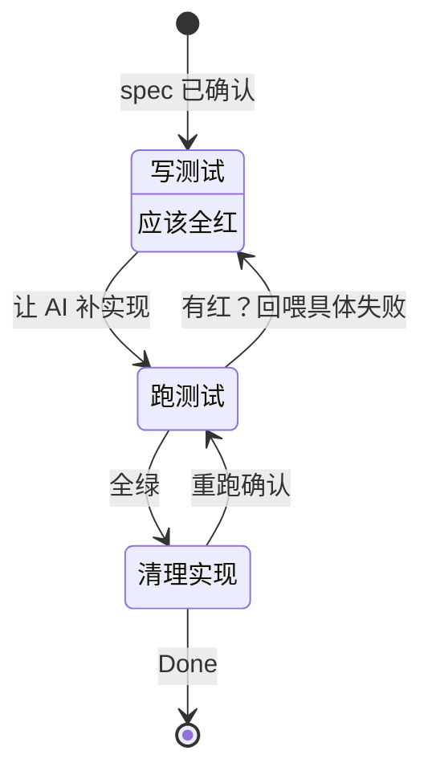

# TDD

> **测试先行的红→绿→重构循环。** 让 AI 写实现前先写测试——测试是 AI 的"退出标准"。

## What it is

**红（Red）→ 绿（Green）→ 重构（Refactor）**：

```
Spec（已确认）
  ↓
[红]  按 spec 写测试 → 跑 → 全红（没实现）
  ↓
[绿]  AI 补实现 → 跑到全绿
  ↓            ↳ 失败？回喂"具体断言 + 输入"
[重构] 测试保持绿，清理实现
```

## Key Properties / Tradeoffs

✅ **优点**：
- **审查成本前移**：人审测试（机器能判的合同），不审实现
- **机器能判对错**：spec 容易被"再讨论"，测试红了你装看不见
- **故意改坏自检**：改一处实现 → 对应测试必须红（验证"测试在兜底"）

⚠️ **反模式**：
- ❌ 把失败测试注释掉"通过" → 失去兜底
- ❌ 让 AI 一次写完整个服务 → 复杂度爆炸
- ❌ "尽量做单元测试" → AI 听不懂"尽量"
- ❌ 测私有方法 → 重构即崩

## Relationship to Other Concepts

- [[Spec Driven Development]] — spec §5 边界 = 测试清单
- [[Harness Engineering]] — TDD 是 Harness 的"反馈"层核心
- [[todo-api]] — TDD 的最小可跑范例（8 条测试）

## Mermaid Diagram



## Open Questions

- [ ] Mutation testing 何时进 CI 硬关？
- [ ] AI 写测试的有效性怎么验（meta-test）？
- [ ] 覆盖率门槛多少合适？

## Sources

- `materials/02_测试先行清单.md` — 本仓库的 TDD 清单
- `code/backend/tests/test_todo_api.py` — 8 条 pytest 范例
