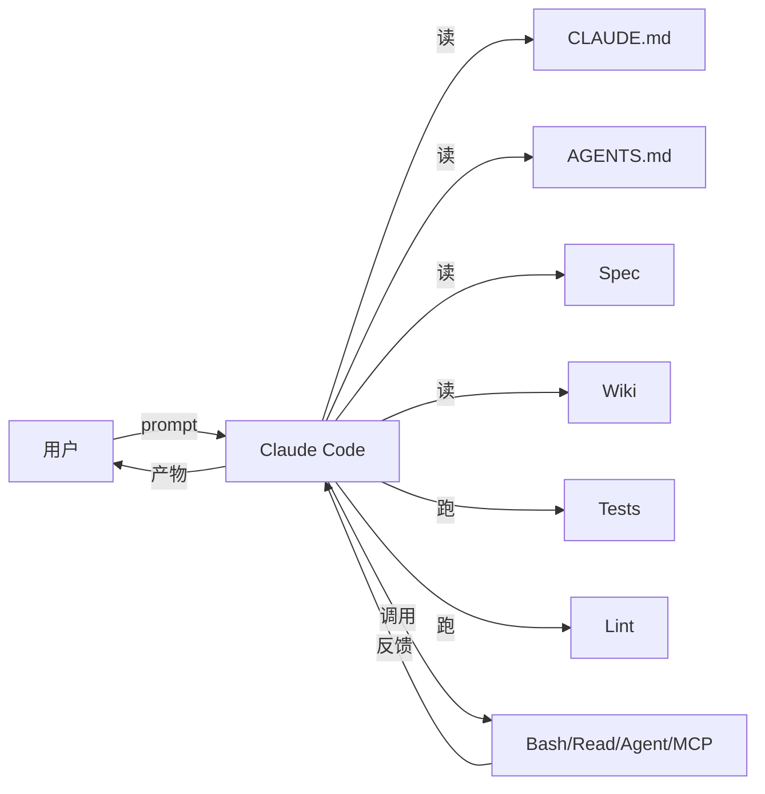

# claude-code

> Anthropic 的 agentic 编码工具。本仓库默认 agent。

## Key Features / Known Issues

**核心能力**：
- 计划/执行/验证/审查 全流程
- 子代理（Agent 工具）— 搜索、审查、跨文件重构
- Skills 复用动作
- MCP 协议接入外部工具
- Plan mode：先出方案再执行

**配套机制**：
- `CLAUDE.md`（项目根）— Claude 入口
- `AGENTS.md`（项目根）— 跨工具通用规则
- `wiki/CLAUDE.md`（Wiki Schema）— Wiki 维护规范

**已知使用习惯**（见根 [[../CLAUDE.md]] §8）：
- 复杂任务先 plan mode
- 反馈要具体（断言 + 输入 + 期望）
- 不可逆操作必人确认

## Related Concepts

- [[Harness Engineering]] — Claude Code 是 Harness 中的 Model 组件
- [[Spec Driven Development]] — 用 Claude 实现 SDD 流水线
- [[TDD]] — Claude 跑红→绿循环的退出标准
- [[fastapi]] — 本项目用 Claude 写的

## Mermaid Diagram

## Sources

- 根 `CLAUDE.md` §8 — Claude 专属习惯
- [Anthropic Claude Code 文档](https://docs.anthropic.com/)
