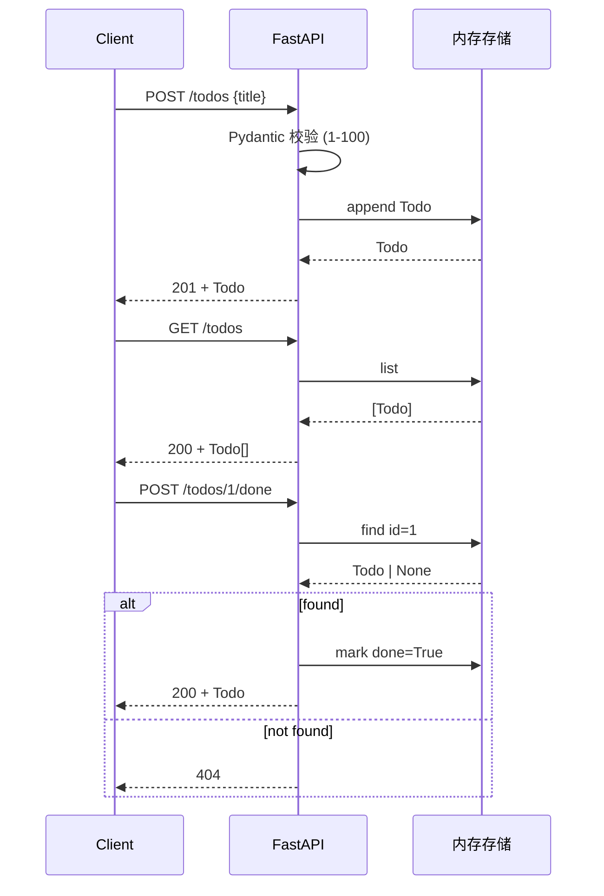

# todo-api

> SPEC-001 的 FastAPI 实现。本仓库的最小可跑范例——3 端点 + 内存存储 + 8 条 pytest。

## Key Features / Known Issues

**端点**（[SPEC §4](../code/backend/SPEC-001-todo-api.md)）：
- `POST /todos` — 新建（空/仅空白/超长 → 422）
- `GET /todos` — 列表（按 id 升序）
- `POST /todos/{id}/done` — 标记完成（幂等；id 不存在 → 404）

**已知约束**（[SPEC §2.2](../code/backend/SPEC-001-todo-api.md)）：
- ❌ 不做删除 / 编辑 / 分页 / 持久化 / 鉴权

**测试**：`code/backend/tests/test_todo_api.py`（3 happy + 5 边界 = 8 passed）

## Related Concepts

- [[Spec Driven Development]] — 本项目是 SDD 的最小范例
- [[TDD]] — 8 条测试都是 TDD 红→绿循环产物
- [[fastapi]] — 后端框架
- [[Harness Engineering]] — 由本项目的 5 道 CI 硬关 + AGENTS.md 体现

## Mermaid Diagram

## Sources

- `code/backend/SPEC-001-todo-api.md` — 规格
- `code/backend/openapi.yaml` — 机器可读契约
- `code/backend/tests/test_todo_api.py` — 8 条测试
